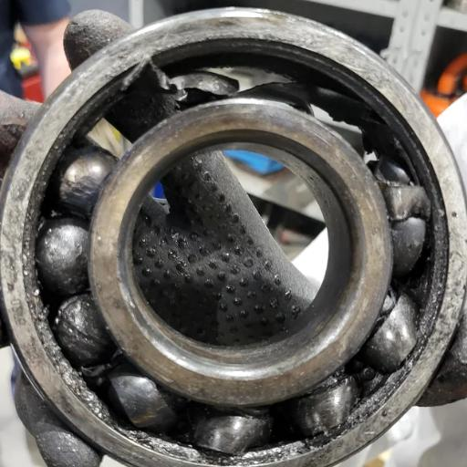

# Tata Steel Industrial AI Platform - Complete Setup Guide

Welcome to the **Maintenance Wizard** Industrial AI Platform! 
Follow these exact steps to run the application from scratch on a brand new machine.

---

## 📁 Project Folder Structure

Understanding how the application is organized:

```text
Tata_Steel_AI/
│
├── backend/            # Core backend infrastructure. Contains the FastAPI server, database models, 
│                       # API routers (for Auth, Engineering, Manager, Supervisor), service layers 
│                       # (RAG, Ollama AI, Vector Storage), and file storage systems.
│
├── frontend/           # The vanilla HTML, CSS, and JS web interfaces for all user roles. 
│                       # Contains separate portals for Engineers, Shift Supervisors, and Managers.
│
├── docs/               # Comprehensive system documentation, including architecture diagrams, 
│                       # API route maps, database schemas, and final acceptance/audit reports.
│
├── scratch/            # Temporary experimental scripts, test files, and notification checkers 
│                       # used during active development and debugging.
│
├── start_app.py        # The unified startup orchestrator script.
├── requirements.txt    # Python dependency lockfile.
└── docker-compose.yml  # Docker configuration for containerized deployment.
```

---

## ✨ Platform Features & Capabilities

The Maintenance Wizard is a comprehensive, production-ready Agentic AI platform built with a wide array of advanced features specifically tailored for industrial environments:

### 🤖 1. Specialized Agentic AI
*   **Engineering Assistant**: A conversational AI agent that can diagnose equipment failures, recommend repair strategies, and summarize complex manuals.
*   **Computer Vision Diagnostics**: Engineers can upload images of broken machinery or parts, and the AI agent uses Vision Models to analyze the visual data and suggest repair steps.
*   **Automated Workflows**: The AI dynamically detects intents during a chat session to automatically trigger workflows, such as generating maintenance work orders and inventory requests without manual form entry.

### 📚 2. Advanced RAG Pipeline (Retrieval-Augmented Generation)
*   **PDF Knowledge Ingestion**: Managers can upload massive PDF technical manuals and Standard Operating Procedures (SOPs).
*   **Vector Database Integration**: Uploaded documents are automatically chunked, embedded using `BAAI/bge-small-en-v1.5`, and stored in a local ChromaDB instance for ultra-fast semantic search.
*   **Source Citations & Metadata**: The AI accurately cites exact page numbers and document names when providing technical advice, ensuring perfect traceability.

### 👥 3. Role-Based Access Control (RBAC) & Portals
*   **Manager Portal**: Full administrative oversight, including PDF document library management, user auditing, and system-wide analytics.
*   **Supervisor Dashboard**: Live tracking of shift metrics, plant health, active escalations, open maintenance requests, and team management.
*   **Engineer Portal**: Focuses purely on execution—featuring the active AI Sandbox, assigned work orders, equipment lists, and safety compliance tools.

### ⚙️ 4. Intelligent Orchestration & Escalations
*   **Dynamic Escalation Matrix**: Automatically tracks overdue maintenance requests, critical equipment downtime, and triggers live escalations to Shift Supervisors.
*   **Inventory Tracking**: Live tracking of warehouse parts with automated "Low Stock" warnings integrated into the Supervisor reports.
*   **Safety Compliance Tracker**: Manages safety waivers and tracks maintenance operations to ensure factory compliance protocols are strictly met.

---

## 🛠️ Step 1: Install Python
This project requires **Python 3.10 or higher**.

1. Download and install Python from the official website: [python.org/downloads](https://www.python.org/downloads/)
2. **Important for Windows:** During installation, make sure to check the box that says **"Add Python to PATH"**.
3. Open your terminal or command prompt.

---

## 📦 Step 2: Create and Activate a Virtual Environment
You must create an isolated environment (`venv`) to prevent package conflicts.

1. Navigate to the root project folder:
   ```bash
   cd path/to/Tata_Steel_AI
   ```

2. **Create the virtual environment:**
   ```bash
   python -m venv env
   ```

3. **Activate the environment:**
   - **Windows:**
     ```bash
     env\Scripts\activate
     ```
   - **Mac/Linux:**
     ```bash
     source env/bin/activate
     ```

---

## ⚙️ Step 3: Install Required Dependencies
Once your environment is active, install all the locked production dependencies.

1. Ensure your terminal is inside the root folder and your environment is activated (`(env)` should appear in your prompt).
2. Install the packages using pip:
   ```bash
   pip install -r requirements.txt
   ```

---

## 🧠 Step 4: Install Ollama (AI Engine)
Because this platform uses completely private, locally-hosted AI models, you need to install Ollama to serve them.

1. **Install Ollama**: Download it from [ollama.com/download](https://ollama.com/download) and install it.
2. **Start Ollama** (if it isn't running automatically in your background/taskbar):
   ```bash
   ollama serve
   ```
*(Note: You do not need to manually download the AI models! The startup script in Step 5 will automatically verify and pull the required models for you.)*

---

## 🚀 Step 5: Start the Application!
Everything is now installed and configured. You can boot up both the **Frontend** and the **Backend** concurrently using our built-in orchestration script.

1. Ensure you are in the root directory and your virtual environment is activated.
2. Run the start script:
   ```bash
   python start_app.py
   ```

**The script will automatically:**
1. Connect to Ollama and pull all required AI models (`mistral`, `qwen2.5-coder`, etc.) if they aren't already installed.
2. Start the FastAPI Backend on `http://localhost:8000`
3. Start the Web Frontend on `http://localhost:3000`
4. Automatically open your default web browser directly to the Login portal!

To safely stop the servers, simply press `Ctrl+C` in your terminal. Good luck with the Hackathon!

---

## 🔓 Step 6: Quick-Access Login Cards (No Typing Required)
To make testing as seamless as possible for the judges, we have built a rapid-access login page. You do not need to manually type any usernames or passwords. 
1. When you arrive at the `http://localhost:3000` login page, simply click on one of the three **Role Cards** (Manager, Supervisor, or Engineer).
2. The system will automatically inject the secure credentials and instantly log you into that specific dashboard!

---

## 📥 Step 7: Complete User Flow & Demo Data Initialization

To fully evaluate the platform, judges must follow this exact sequence to populate the databases, map the user roles, and verify the AI training documents.

### Phase A: Manager Data Mapping (Database Initialization)
1. Click the **Plant Manager** login card.
2. You will be greeted by the **Manager Dashboard Overview** showing live plant metrics.
3. Using the left sidebar menu, you must upload the provided sample `.csv` files from the `EXAMPLE/` folder to populate the company database. **Please upload them in this exact order to ensure relationships map correctly:**
   * **Engineer Management** $\rightarrow$ Upload `users.csv`
   * **Supervisor Management** $\rightarrow$ Upload `supervisor_directory (1).csv`
   * **Supervisor Management** $\rightarrow$ Upload `engineer_supervisor_mapping (1).csv`
   * **Equipment Registry** $\rightarrow$ Upload `equipment (1).csv`
   * **Equipment Registry** $\rightarrow$ Upload `supervisor_equipment_mapping (1).csv`
   * **Equipment BOM** $\rightarrow$ Upload `equipment_parts.csv`
   * **Inventory** $\rightarrow$ Upload `inventory (1).csv`
   * **Work Orders** $\rightarrow$ Upload `work_orders.csv`
   * **Maintenance History** $\rightarrow$ Upload `maintenance_history.csv`

### Phase B: Document Verification Flow (RAG Knowledge Base)
The Engineering AI Agent operates on strict compliance. It will **NOT** read or reference any uploaded manual unless it has been explicitly approved by a Manager.
1. While still logged in as the **Manager**, navigate to the **Document Library** via the sidebar.
2. Upload the provided PDF manual: `EXAMPLE/t999_user_manual.pdf`.
3. Once uploaded, the document will appear in the library table with a status of **"Pending"**.
4. **Crucial Step:** You must click the dropdown menu next to the document and change its status to **"Approved"**. 
5. The moment it is approved, the backend automatically chunks and vectorizes the PDF into the local ChromaDB database, making it instantly available to the AI.

---

## 👷 Step 8: Exploring the Engineer Portal & Daily Execution

The Engineer Portal is the operational heart of the platform. This is where maintenance workers manage their assigned machinery, check active work orders, and interact with the AI.

### 1. Accessing the Workspace
1. Click **Logout** from the Manager portal, and click the **Engineer** login card on the home screen.
2. You will land on the **Engineer Workspace Overview** dashboard to instantly view your assigned KPI metrics (Assigned Equipment, Open Work Orders, Pending Requests).

### 2. Managing Daily Operations
Use the left sidebar menu to navigate the execution workflows:
* **My Equipment**: View a list of all heavy machinery currently assigned to your profile based on the data the Manager mapped earlier.
* **Work Orders**: View all your assigned, active maintenance tasks.
* **Inventory & Parts**: Browse the factory's live database of spare parts (valves, bearings).
* **Maintenance History**: Review a comprehensive log of all past repairs performed on your assigned equipment.

---

## 🧠 Step 9: Testing the Intelligent Engineering Agent (AI Sandbox)

The most powerful feature of the Engineer Portal is the multimodal AI assistant built to help troubleshoot mechanical failures on the factory floor. 

### 1. Testing the RAG Pipeline (PDF Knowledge Retrieval)
1. Click on **Engineering Agent** in the left sidebar.
2. Because the Manager approved the document in Phase B, you can now test the AI. Ask it a technical question: *"What is the standard operating procedure for the T999 machine?"* 
3. The AI will instantly search the approved manuals and provide a highly accurate, summarized response complete with specific source citations. *(If the manager had rejected the document, the AI would have safely stated it does not have the knowledge).*

### 2. Testing Computer Vision Diagnostics
The agent can also "see" physical damage and diagnose it using Vision AI models.
1. Click the **Attachment (Paperclip) icon** next to the chat bar.
2. Select and upload the provided sample image: `EXAMPLE/test_equipment_defect.jpeg`.
3. Type a prompt alongside the image, such as: *"Analyze this visual defect and tell me exactly how to repair it."*
4. The Vision AI will process the image, identify the structural fault, and output a step-by-step repair strategy.
<br>

### 3. Testing Automated Workflow Triggers
1. In the chat, type an intent-driven command like: *"I need to order 5 replacement bearings for the main conveyor."*
2. The AI will seamlessly intercept the intent and automatically generate an **Inventory Request ticket** in the background, without requiring you to manually fill out any forms!

---

## 📊 Step 10: Supervisor Monitoring
1. Log out and click the **Shift Supervisor** login card.
2. Navigate the left sidebar to view the results of the data you mapped in Phase A. You will see real-time Plant Health summaries, low Inventory Alerts, and dynamic Work Order Escalations generated automatically for your specific shift!
