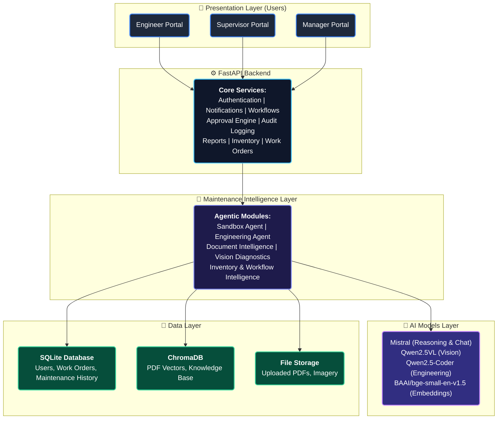
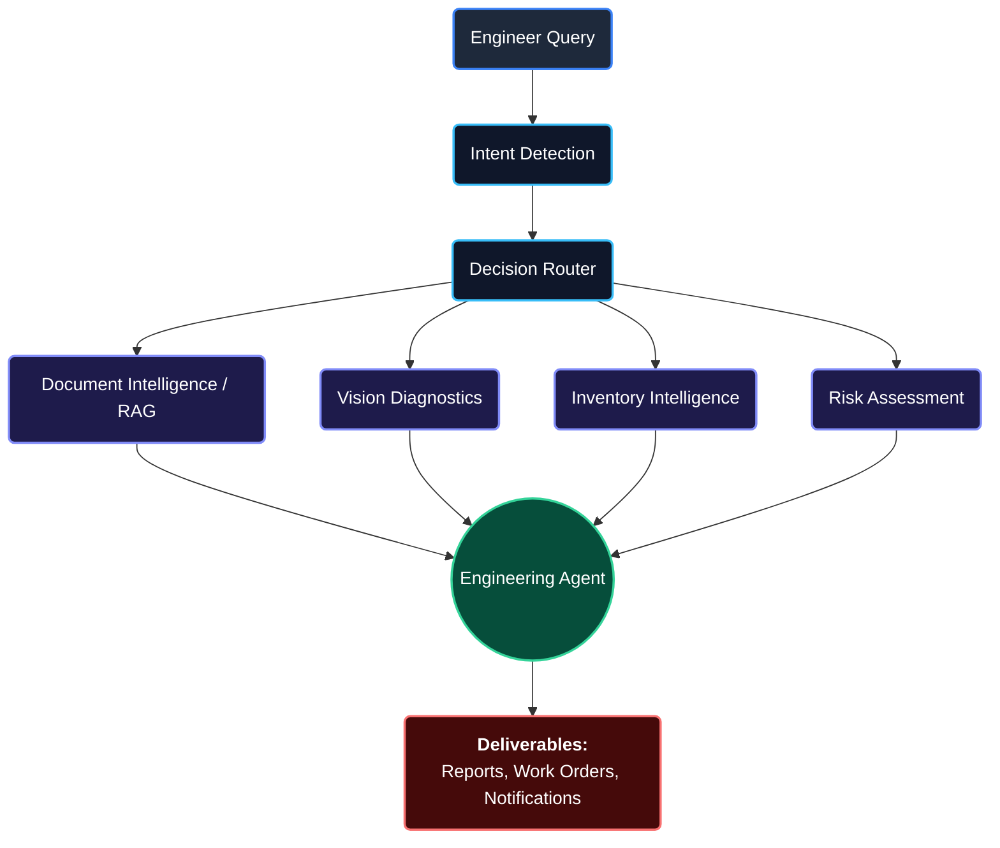
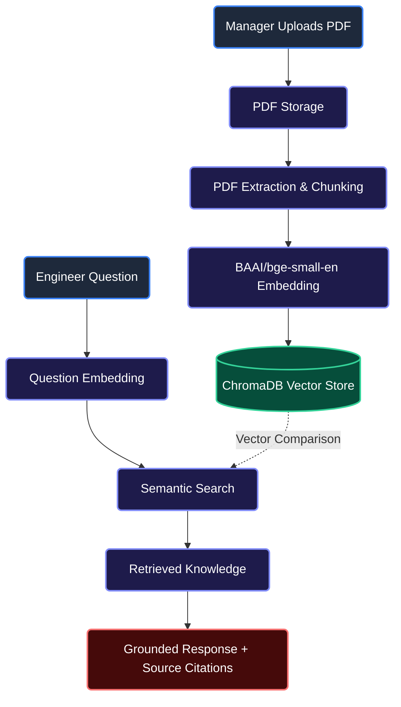
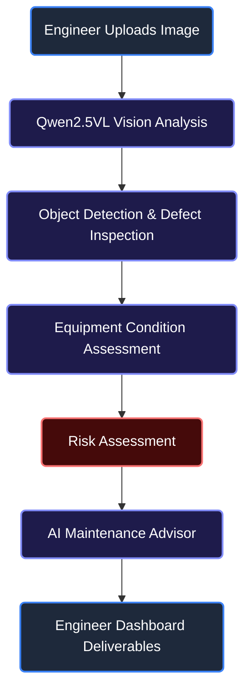
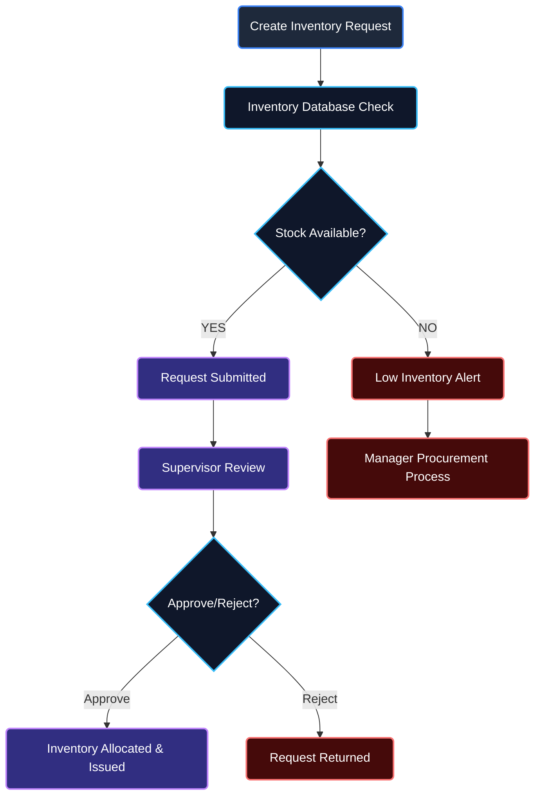
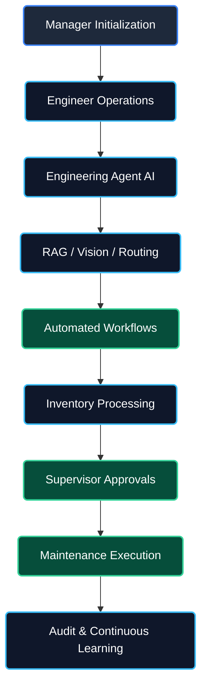

# Tata Steel Industrial AI Platform - System Architecture

This document provides a comprehensive overview of the Enterprise Architecture for the Maintenance Wizard platform. 

## 1. Complete System Architecture

---

## 2. Engineering Agent Workflow

---

## 3. Document Intelligence (RAG) Workflow

---

## 4. Vision Diagnostics Workflow

---

## 5. Inventory & Approval Workflow

---

## 6. End-to-End Industrial AI Maintenance Workflow

---

## 7. Database Relationships
The platform uses SQLite for relational persistence mapping the physical factory environment.

- **Users**: (Plant Managers, Shift Supervisors, Maintenance Engineers)
- **Equipment Registry**: Core machines linked to Supervisors and assigned to Engineers.
- **Inventory/BOM**: Spare parts mapped to their respective compatible equipment.
- **Work Orders**: Connects Engineers to specific Equipment, documenting the repair process and inventory consumed.
- **Maintenance History**: Long-term audit trail of completed Work Orders used for MTBF (Mean Time Between Failures) analytics.
