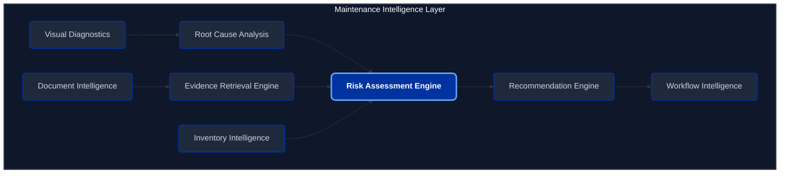
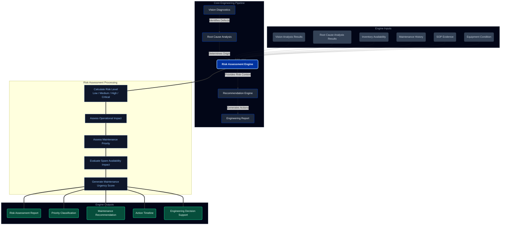
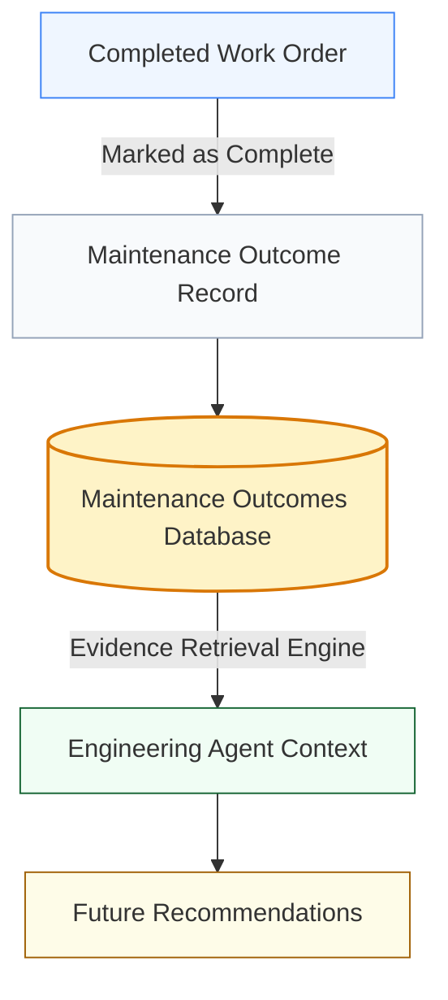

# Hackathon Architecture

The Tata Steel Industrial Maintenance Platform is built using a modern, multi-agent AI architecture.

## Tech Stack
- **Frontend**: Vanilla HTML/JS/CSS (No frameworks, for rapid prototyping). Custom RBAC implemented via JS checking JWT tokens.
- **Backend**: FastAPI (Python 3)
- **Database**: SQLite with SQLAlchemy ORM
- **AI/LLM**: Local Ollama running `mistral:latest`
- **Vector DB**: ChromaDB for Retrieval-Augmented Generation (RAG)
- **Deployment**: Docker Compose with Nginx reverse proxy

## AI Agent Ecosystem

### 1. Engineering Agent
- **Purpose**: Formal maintenance sessions.
- **Features**: Highly structured prompting, intent detection (Industrial vs Software), adaptive requirement collection, and persistent memory extraction.

### 2. Sandbox Agent
- **Purpose**: Informal experimentation.
- **Features**: Loose prompting, document upload for local context, and capability to escalate to a formal Engineering Session.

### 3. Service Agents (Specialized)
- **Document Agent**: Processes PDFs, chunks them, and embeds them into ChromaDB.
- **Safety Agent**: Evaluates task domains and equipment to generate safety checklists (e.g., LOTO).
- **Audit Agent**: Tracks user actions silently in the background for compliance.

## Multi-Agent Communication
Agents communicate via the `transfer_service.py` which passes context (JSON summaries) between agent types, and `memory_service.py` which continuously extracts key facts from conversations into a structured database to prevent redundant questioning.
# Engineering Agent Architecture

This document details the enhanced architecture of the Engineering Agent, featuring the newly integrated **Risk Assessment Engine** within the Maintenance Intelligence Layer.

## 1. Maintenance Intelligence Architecture

The following architectural diagram illustrates the components of the Maintenance Intelligence Layer.

## 2. Risk Assessment Workflow

The workflow diagram below demonstrates the pipeline from vision diagnostics through risk assessment to the final engineering report. It includes the inputs, processing stages, and outputs of the new Risk Assessment Engine.

## 3. Sample Output Evaluation

> [!WARNING]
> **Asset**: Conveyor Motor CM-101  
> **Detected Issue**: Bearing Wear  
> **Root Cause**: Lubrication Failure  
> **Risk Level**: High  
> **Operational Impact**: Potential downtime within 72 hours  
> **Maintenance Priority**: P1 Critical  
> **Recommended Action**: Immediate inspection and bearing replacement

## Maintenance Outcome Learning Repository

The Maintenance Outcome Repository provides a traceable knowledge base of all completed maintenance work. This is not autonomous retraining, but rather a structured evidence retrieval system.

### Workflow

### Purpose
When an Engineer completes a Work Order, the final root cause, taken action, risk level, and downtime avoided are securely logged into the `maintenance_outcomes` table. Future queries to the Engineering Agent related to the same asset or issue will retrieve these outcomes as contextual evidence, significantly speeding up future diagnostics.
